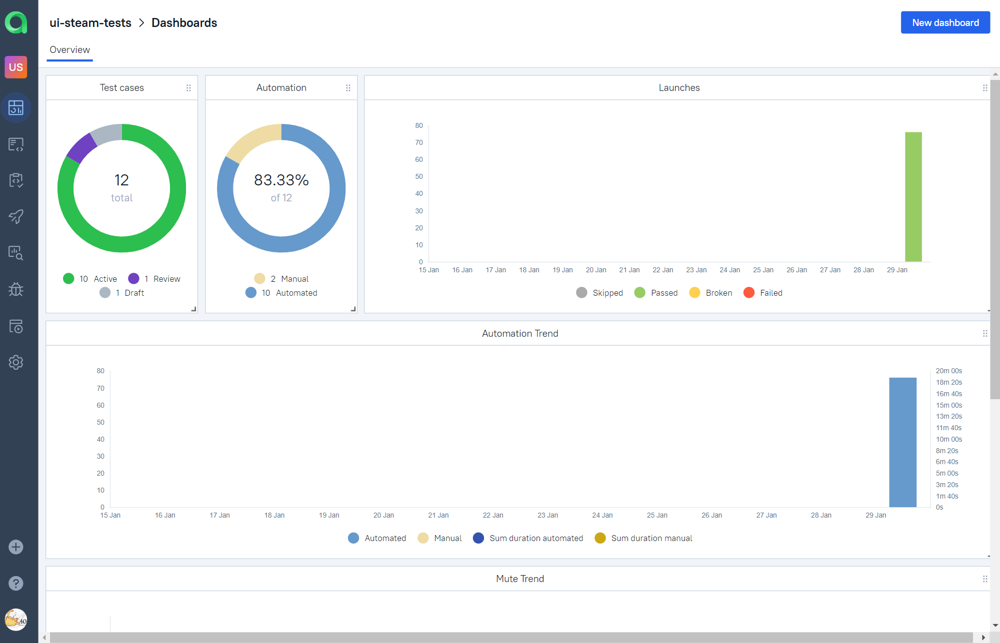

# Test automation project for [Steam](https://store.steampowered.com/)

<p align="center"><a href="https://store.steampowered.com/"></a></p>  

## :bookmark_tabs: Contents
- [Technologies and tools](#computer-technologies-and-tools)
- [Features](#star2-features)
- [Test cases](#clipboard-test-cases)
- [Running tests locally](#rocket-running-tests-locally)
- [Build in Jenkins](#-build-in-jenkins)
- [Test results in Allure report](#-test-results-in-allure-report)
- [Test management in Allure TestOps](#-test-management-in-allure-testops)
- [Integration with Jira](#-integration-with-jira)
- [Notification of test results in Telegram](#-notification-of-test-results-in-telegram)
- [Test video from Selenoid](#-test-video-from-selenoid)


## :computer: Technologies and tools
<p align="center">
<a href="https://www.jetbrains.com/idea/"></a>
<a href="https://www.java.com/"></a>
<a href="https://github.com/allure-framework"></a>
<a href="https://qameta.io/"></a>
<a href="https://gradle.org/"></a>
<a href="https://junit.org/junit5/"></a>
<a href="https://selenide.org/"></a>
<a href="https://aerokube.com/selenoid/"></a>
<a href="https://github.com/"></a>
<a href="https://www.jenkins.io/"></a>
<a href="https://web.telegram.org/"></a>
<a href="https://www.atlassian.com/software/jira/"></a>
</p>

Automated tests are written in the `Java` language using `JUnit 5` and `Selenide`. The project is built with `Gradle`. 
For remote execution, a task is implemented in `Jenkins` to generate an `Allure report` and send the results to `Telegram` using a bot. 
Remote execution is carried out in `Selenoid`. 
To manage test scenarios and manually initiate test runs, `Allure TestOps` is utilized, and the results of their completion are linked to `Jira` issues.

## :star2: Features
- `Parameterized tests`: Efficiently validates test logic across diverse scenarios with varied input values for comprehensive coverage
- `Page Objects`: Uses the pattern for improved test organization and maintenance
- `Chain of Invocations`: Establishes a clear and traceable path for test scenarios by implementing a cohesive series of Allure steps.
- `Configuration files`: Provides various configurations for seamless test execution in different environments using `Owner library` through Java properties files
- `Parameterized build`: Enables easy configuration and customization of test runs.
- `Parallel Execution`: Speeds up tests, providing faster feedback and reduced time
- `Custom Allure listener`: Captures screenshots, videos, browser console logs, and page source code for comprehensive test reporting
- `Allure TestOps integration`: Unifies test reporting, analytics and launch management
- `Jira Integration`: Streamlines issue tracking, collaboration, and integrates Allure for test case and launch management
- `Autotests as Documentation`: Provides real-time insight into project functionality

## :clipboard: Test cases

- :white_check_mark: Add game to cart
- :white_check_mark: Remove game from cart
- :white_check_mark: Remove all items from cart
- :white_check_mark: Go to genre page from genres sidebar
- :white_check_mark: Language selection changes main navbar locale
- :white_check_mark: Search dropdown contains searched game
- :white_check_mark: Search page contains searched
- :white_check_mark: Go to game page from search results

## :rocket: Running tests locally

### Local launch

```bash
gradle clean test -Denv=local
```

### Remote launch

```bash
gradle clean test -Denv=remote
```

### Parametrized remote launch

```bash
gradle clean test
-Dbrowser=${browser}
-DbrowserVersion=${browserVersion}
-DbrowserSize=${browserSize}
-DremoteUrl=${remoteUrl}
```
> `${browser}` - browser name (_default - <code>chrome</code>_).
>
> `${browserVersion}` - browser version number (_default - <code>100.0</code>_).
>
> `${browserSize}` - browser window size (_default - <code>1980x1080</code>_).
>
> `${remoteUrl}` - address of the remote server on which the tests will be run.
>

##  Build in [Jenkins](https://jenkins.autotests.cloud/job/ui-steam-tests/)
<p align="center">  
</a>  
</p>

##  Test results in [Allure report](https://jenkins.autotests.cloud/job/ui-steam-tests/allure/)
<p align="center">  
</a>  
</p>
<p align="center">  
</a>  
</p>

##  Test management in [Allure TestOps](https://allure.autotests.cloud/project/4010/dashboards)
<p align="center">  
</a>  
</p>
<p align="center">  
</a>  
</p>

##  Integration with [Jira](https://jira.autotests.cloud/browse/HOMEWORK-1091)
<p align="center">  
</a>  
</p>


##  Notification of test results in [Telegram](https://play.google.com/store/apps/details?id=org.telegram.messenger&hl=ru&gl=US)
<p align="center">  
</a>  
</p>

##  Test run in [Selenoid](https://aerokube.com/selenoid/)
<p align="center">  
</a>  
</p>
